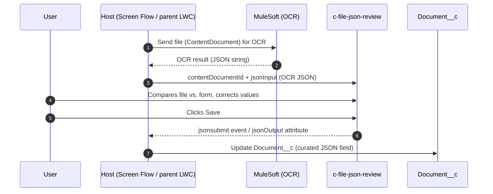
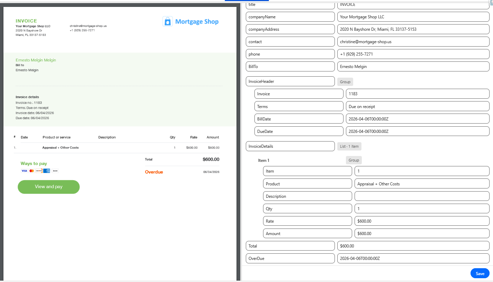
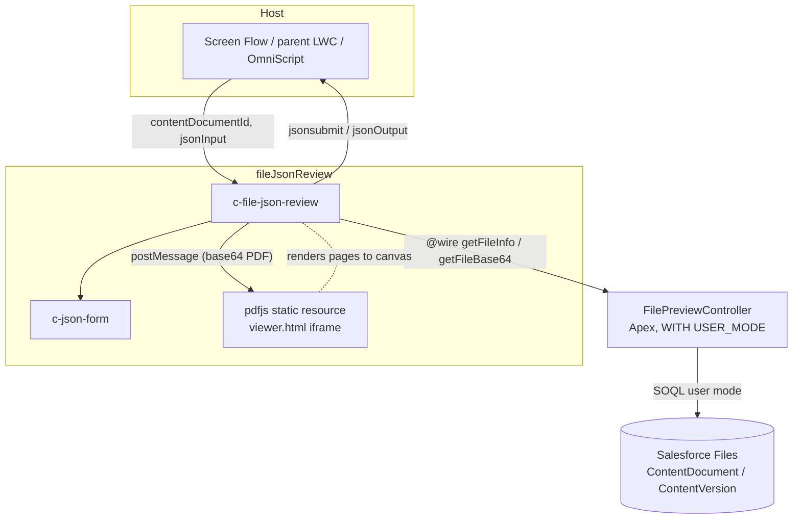
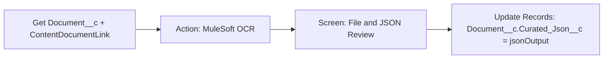
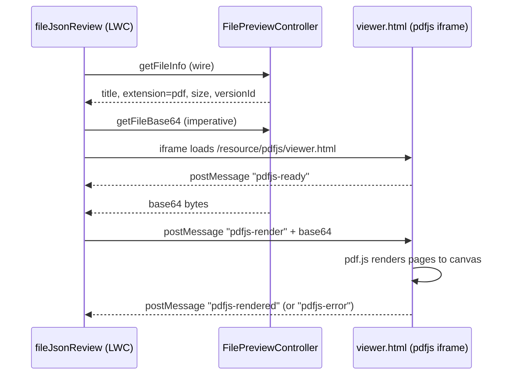

# Document Previewer (`fileJsonReview`)

> **Audience:** Salesforce senior developers and administrators.
> **Scope:** the `c-file-json-review` Lightning Web Component, its dependencies, integration patterns (Screen Flow / parent LWC / OmniStudio), and org-to-org deployment.

---

## 1. Purpose and business context

`fileJsonReview` is the **human curation step** of the document-OCR pipeline:

1. A document (PDF or image) stored in Salesforce Files is sent to an integration through **MuleSoft**.
2. MuleSoft performs **OCR** on the file and returns the extracted data as a **JSON** payload.
3. `fileJsonReview` shows the **original file** (left pane) side by side with the **OCR JSON rendered as an editable form** (right pane), so the user can verify and correct the extraction against the source document.
4. On **Save**, the curated JSON is returned to the host (Flow or parent LWC), which stores it back on the **`Document__c`** custom object.



> **Note:** the MuleSoft callout itself is **out of scope** for this component — it neither calls MuleSoft nor writes to `Document__c`. It is a pure presentation/curation component: JSON in, curated JSON out. This keeps it reusable for any file + JSON pairing.


*Figure 1 — Component overview (placeholder: replace with a real screenshot).*

---

## 2. What the user sees

- **Left pane** — preview of the file identified by `contentDocumentId`:
  - **PDF** → rendered inline by a bundled PDF.js viewer (consistent across browsers/devices).
  - **JPG / PNG / GIF** → rendered as an image.
  - Other types → a friendly "preview not available" message.
- **Divider** — drag with the mouse, or focus it and use the arrow keys (accessible, clamped 20–80 %).
- **Right pane** — the OCR JSON rendered by `c-json-form`:
  - one textbox per **field label** (editable → renames the JSON key, order preserved),
  - one textbox per **field value** (editable → type-preserving: numbers stay numbers, booleans stay booleans),
  - nested objects/arrays render as indented **Group** / **List** sections,
  - a **Save** button (configurable label) that returns the curated JSON.


*Figure 2 — Editing the OCR result (placeholder).*

---

## 3. Component inventory and dependencies

Everything lives in `force-app/main/default/`. **All items below must move together** when deploying to another org.

| Component | Type | Path | Role |
| --- | --- | --- | --- |
| `fileJsonReview` | LWC | `lwc/fileJsonReview` | The split-screen previewer (this document). |
| `jsonForm` | LWC | `lwc/jsonForm` | Child component: renders/edits the JSON. Reusable on its own. |
| `FilePreviewController` | Apex class | `classes/FilePreviewController.cls` | Resolves file metadata and returns PDF bytes as base64. |
| `FilePreviewControllerTest` | Apex test | `classes/FilePreviewControllerTest.cls` | Test coverage (required for production deploys). |
| `pdfjs` | Static resource | `staticresources/pdfjs` | Mozilla PDF.js v6.1.200 + custom `viewer.html`. |



**No external dependencies:** no npm runtime packages, no Experience Cloud CSP entries, no named credentials, no remote-site settings. The MuleSoft integration is entirely on the host side.

---

## 4. Public API — `c-file-json-review`

| API | Kind | Description |
| --- | --- | --- |
| `content-document-id` | `@api` (String) | Id (`069…`) of the ContentDocument to preview. |
| `json-input` | `@api` (String) | The OCR JSON string to render in the right pane. Setting it resets any prior edits. |
| `json-output` | `@api` (String, read-only) | The JSON string including the user's edits. Also a Flow **output** attribute, kept live via `FlowAttributeChangeEvent`. |
| `height` | `@api` (String) | CSS height, default `600px` (e.g. `70vh`). |
| `submit-label` | `@api` (String) | Save button label, default `Save`. |
| `onjsonchange` | event | Fired on **every edit**. `detail.value` (object), `detail.jsonString` (string). |
| `onjsonsubmit` | event | Fired on **Save click**. Same detail shape — this is the "user is done curating" signal. |

Design intent: `jsonchange`/`jsonOutput` give you the *live* value (useful when the user can leave the screen any way they like); `jsonsubmit` gives you an *explicit confirmation* moment (useful to trigger the `Document__c` update).

---

## 5. Hosting patterns

### 5.1 Screen Flow (typical for the OCR pipeline)

The component is exposed to `lightning__FlowScreen` as **File and JSON Review**.

1. Upstream of the screen: call MuleSoft (e.g., via an Invocable Apex action or External Service) and put the returned JSON into a **text variable** (e.g., `varOcrJson`).
2. Add a **Screen** element, drop **File and JSON Review** on it:
   - **Content Document Id** ← the file's `069…` id (e.g., from `ContentDocumentLink` on `Document__c`),
   - **Source JSON** ← `varOcrJson`,
   - optionally **Height** / **Save Button Label**.
3. After the screen: read **Modified JSON** (`jsonOutput`) into a variable and use an **Update Records** element to write it to your JSON field on `Document__c` (e.g., `Curated_Json__c`, a Long Text Area sized for your payloads).

> `jsonOutput` is updated on every keystroke *and* on Save, so it is current regardless of how the user exits the screen (Next, Finish, custom footer).




*Figure 3 — Screen Flow wiring (placeholder).*

### 5.2 Parent LWC

```html
<c-file-json-review
    content-document-id={documentId}
    json-input={ocrJson}
    submit-label="Confirm extraction"
    onjsonsubmit={handleJsonSubmit}
></c-file-json-review>
```

```js
import { updateRecord } from 'lightning/uiRecordApi';
import CURATED_JSON_FIELD from '@salesforce/schema/Document__c.Curated_Json__c';
import ID_FIELD from '@salesforce/schema/Document__c.Id';

handleJsonSubmit(event) {
    const fields = {
        [ID_FIELD.fieldApiName]: this.documentRecordId,
        [CURATED_JSON_FIELD.fieldApiName]: event.detail.jsonString
    };
    updateRecord({ fields });
}
```

### 5.3 OmniStudio

- **OmniScript**: add a *Custom Lightning Web Component* element with `fileJsonReview` as the component name; map `contentDocumentId` and `jsonInput` in Custom LWC Properties (e.g., `%ContentDocumentId%`). To push `jsonOutput` back into the OmniScript data JSON automatically, create a thin wrapper in the OmniStudio org extending `OmniscriptBaseMixin(FileJsonReview)` that calls `this.omniUpdateDataJson(...)` from the `jsonchange`/`jsonsubmit` handlers. The mixin is deliberately **not** imported in this project so it deploys to orgs without OmniStudio.
- **FlexCard**: embed via the *Custom LWC* element, binding attributes to card data (e.g., `{record.ContentDocumentId}`).

---

## 6. How the file preview works (internals)

Understanding this section matters mostly for troubleshooting and maintenance.

### 6.1 Metadata and bytes

`FilePreviewController` (Apex, `with sharing` + `WITH USER_MODE`, so the running user's file access is enforced):

- `getFileInfo(contentDocumentId)` — cacheable; returns title, lower-cased extension, size, `LatestPublishedVersionId`.
- `getFileBase64(contentVersionId)` — cacheable; returns the file bytes base64-encoded. It checks `ContentSize` **before** querying `VersionData`, so an oversized file never enters the Apex heap. The cap is `MAX_PREVIEW_BYTES` = **3 MB** (mirrored client-side as `MAX_PDFJS_BYTES`).

### 6.2 PDF rendering path



**Why bytes travel through Apex + `postMessage`, not a client `fetch()`:** in Lightning, `/sfc/servlet.shepherd/...` redirects cross-origin to the org's file domain (`*.file.force.com`); browsers enforce CORS on that redirect, so `fetch()` fails with `NetworkError` (verified in this org). ``/`<iframe>` tags follow the redirect natively — which is why **images** and the **native fallback** use the servlet URL directly, while PDF bytes go Apex → base64 → `postMessage` (origin-agnostic, same-origin end to end).

### 6.3 Automatic fallback to the browser's native viewer

The component silently falls back to `<iframe src="/sfc/servlet.shepherd/...">` when:

- the file exceeds 3 MB (no Apex round-trip is attempted),
- `getFileBase64` fails,
- the viewer iframe does not report ready within **10 s** (e.g., blocked by CSP).

The fallback relies on the browser's built-in PDF plugin (fine on desktop, variable on mobile).

### 6.4 The `.mjs` MIME constraint (do not regress)

Salesforce serves `.mjs` static-resource files as `application/octet-stream`, and browsers refuse to execute module scripts with that MIME type. The bundled PDF.js build files are therefore **renamed to `.js`** (`pdf.js`, `pdf.worker.js`), with the internal `./pdf.worker.mjs` reference inside `pdf.js` patched to `.js`. Keep this in mind when upgrading PDF.js (see §8).

---

## 7. Moving to another org / sandbox

### 7.1 What to deploy

The five components from §3. With this repo:

```sh
sf org login web -a targetOrg
sf project deploy start -o targetOrg \
  --source-dir force-app/main/default/lwc/fileJsonReview \
  --source-dir force-app/main/default/lwc/jsonForm \
  --source-dir force-app/main/default/classes \
  --source-dir force-app/main/default/staticresources
```

Or with a `package.xml`:

```xml
<?xml version="1.0" encoding="UTF-8"?>
<Package xmlns="http://soap.sforce.com/2006/04/metadata">
    <types>
        <members>fileJsonReview</members>
        <members>jsonForm</members>
        <name>LightningComponentBundle</name>
    </types>
    <types>
        <members>FilePreviewController</members>
        <members>FilePreviewControllerTest</members>
        <name>ApexClass</name>
    </types>
    <types>
        <members>pdfjs</members>
        <name>StaticResource</name>
    </types>
    <version>66.0</version>
</Package>
```

For **production**, run local tests as part of the deploy (`FilePreviewControllerTest` provides the coverage):

```sh
sf project deploy start -o targetOrg --test-level RunLocalTests
```

### 7.2 Post-deploy checklist

| # | Step | Why |
| --- | --- | --- |
| 1 | Grant **Apex class access** to `FilePreviewController` (permission set or profile). | Users without class access get an error instead of a preview. |
| 2 | Confirm users have **read access to the files** (ContentDocument sharing / library membership). | The controller runs `WITH USER_MODE`; no access → "File not found or not accessible". |
| 3 | Host it: add **File and JSON Review** to a Lightning page, or wire the Screen Flow (§5.1) and activate it. | The component does nothing until something passes it a `contentDocumentId` + `jsonInput`. |
| 4 | Recreate host-side plumbing in the target org: the MuleSoft action (External Service / invocable), `Document__c` field for the curated JSON, and the Flow. | Deliberately not part of this component. |
| 5 | Smoke test with a **PDF < 3 MB**, a **PDF > 3 MB** (expect native fallback), and a **PNG/JPG**. | Exercises all three preview paths. |
| 6 | After redeploys, **hard-refresh** (Ctrl+Shift+R) or test in a private window. | Lightning caches components and static resources aggressively. |

> **Version-control note:** deploy from the repo (source of truth), not by "Retrieve" from a working org — the `pdfjs` static resource contains the patched, renamed build files, and a retrieve from an org where someone re-uploaded vanilla PDF.js would silently regress §6.4.

### 7.3 What you do *not* need

- No Custom Metadata, Custom Labels, or Custom Settings.
- No Named Credentials / Remote Site Settings (the component makes no callouts).
- No CSP Trusted Sites (the viewer is a same-origin static resource).
- No OmniStudio packages (unless you add the optional wrapper from §5.3).

---

## 8. Maintaining the bundled PDF.js

PDF.js parses untrusted files — **upgrade periodically** for security fixes.

1. Download `pdfjs-<version>-legacy-dist.zip` from [mozilla/pdf.js releases](https://github.com/mozilla/pdf.js/releases).
2. In `staticresources/pdfjs/`, replace `wasm/`, `standard_fonts/`, `iccs/` and the two build files. **Keep the custom `viewer.html`.**
3. **Rename** `pdf.mjs` → `pdf.js` and `pdf.worker.mjs` → `pdf.worker.js`; patch the internal `./pdf.worker.mjs` reference inside `pdf.js` to `./pdf.worker.js` (§6.4).
4. Exclude `*.map` files; keep the zipped resource under the **5 MB** static-resource limit (currently ~1.7 MB zipped).
5. Redeploy the static resource and hard-refresh.

Not bundled (add only if needed): `cmaps/` (CJK-encoded PDFs). If scanned/JBIG2/JPEG2000 PDFs misbehave, note that `.wasm` files are also served as `application/octet-stream`; PDF.js ships pure-JS `*_nowasm_fallback.js` decoders it can fall back to.

---

## 9. Troubleshooting

| Symptom | Likely cause | Fix |
| --- | --- | --- |
| PDF always falls back to native viewer after ~10 s; console shows `Failed to load module script … MIME type of "application/octet-stream"` | `.mjs` files re-introduced in the static resource | Re-apply the rename (§6.4 / §8). |
| `NetworkError when attempting to fetch resource` | Someone added a client-side `fetch()` of the shepherd URL | Don't — see §6.2. Bytes must come through Apex. |
| "File not found or not accessible" | User lacks access to the ContentDocument, or wrong Id (must be `069…`) | Check file sharing; pass the ContentDocument Id, not ContentVersion (`068…`) or record Id. |
| Large PDF renders in native viewer instead of PDF.js | File > 3 MB cap | Expected. Raise `MAX_PREVIEW_BYTES` (Apex) **and** `MAX_PDFJS_BYTES` (LWC) cautiously — base64 inflates ~33 % and both the blob and the string count against the 6 MB synchronous heap. |
| UI changes not visible after deploy | Lightning component/static-resource caching | Hard refresh (Ctrl+Shift+R) or private window; check the deploy actually succeeded. |
| Save button missing | Old component version cached, or the page hosts `jsonFormDemo` instead of **File and JSON Review** | Same as above; verify the page uses the right component. |

---

## 10. Known limitations

- The curator can **edit** keys and values but cannot **add or remove** fields or array items (deliberate scope decision).
- Array items have positional labels (`Item 1`, `Item 2`, …) — JSON arrays carry no names.
- PDFs above 3 MB use the browser's native viewer (variable UX on mobile).
- The bundled viewer renders pages without zoom/search/thumbnail controls; if reviewers need those, extend `viewer.html` or revisit shipping Mozilla's full viewer UI.
- `jsonInput` must be valid JSON — the host should validate/handle MuleSoft error payloads before showing this screen.

---

*Related docs: [README.md](README.md) (documentation index), [LIQUIDITY_CALCULATOR.md](LIQUIDITY_CALCULATOR.md) (unrelated LQC component).*
